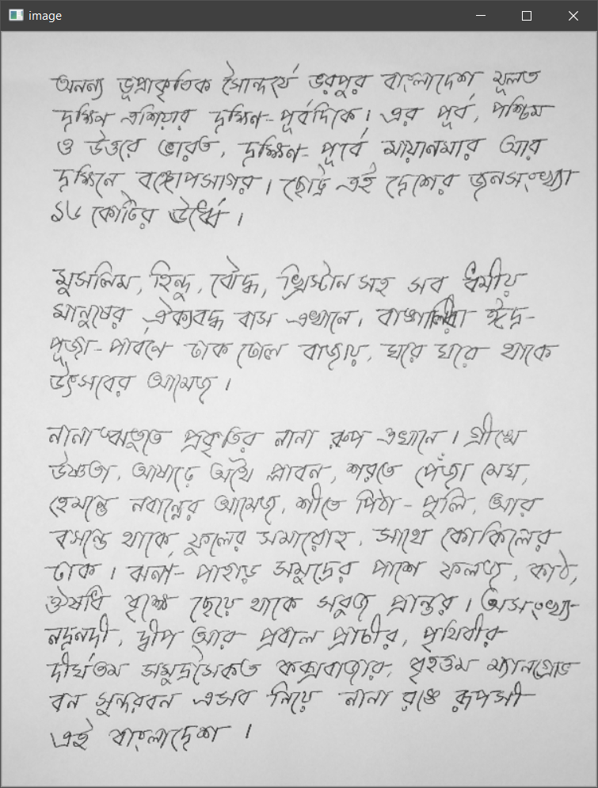
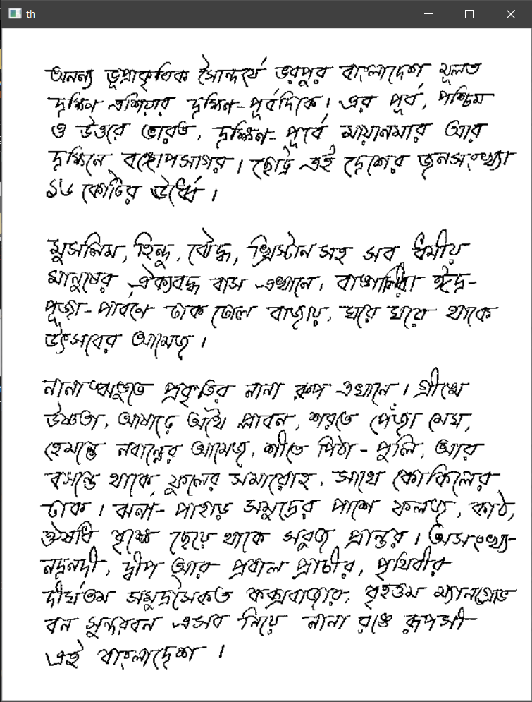
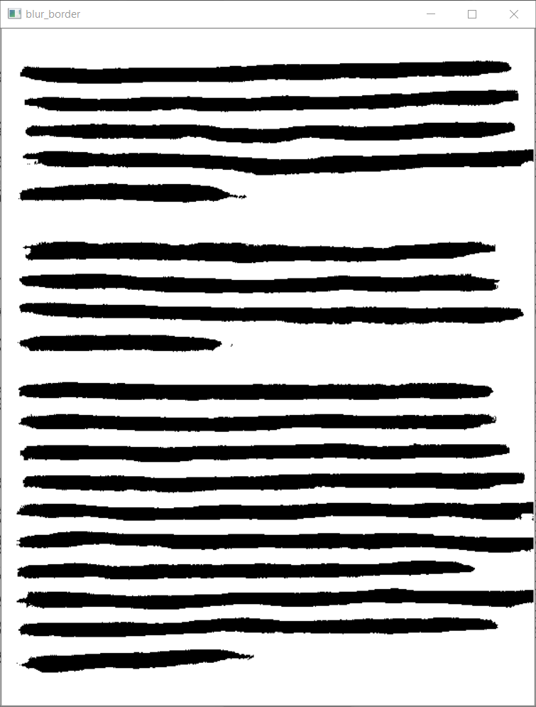
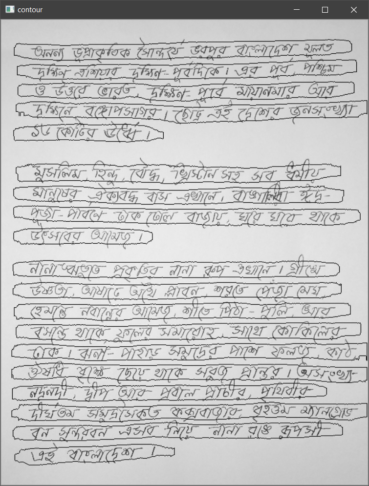
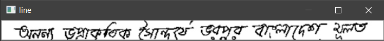
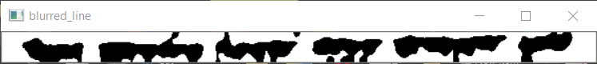
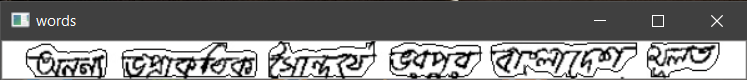

# Bangla-handwritten-word-segmentation-from-document
Segment all the words from a Bengali handwritten document.

## Versions:
python 3.8.5
opencv 4.4.0

## Examples:
```python
python main.py #will segment pages/test.jpg or
```
```python
python main.py pages/1.jpg #will segment pages/1.jpg
```

## Steps:








